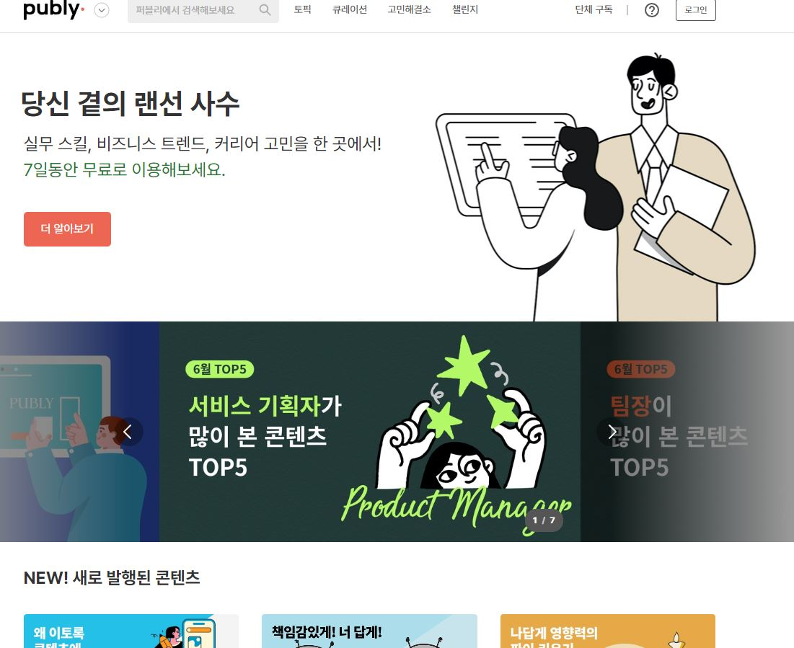

# 본격 탐색의 시작

> 적을 알고 나를 알면 백전백승!

그 첫번째 적에 대해 알아보자!!!

## 퍼블리(PUBLY)

[퍼블리지원페이지](https://www.jumpit.co.kr/position/5377)

주요업무

```
• 위하이어(B2B SaaS) or 커리어리 or 퍼블리 멤버십 웹 / 앱 개발
• 확장성/생산성/안정성을 고려하여 서비스 주요 피처(API, Web, App 포함) 개발
• 사용자 문제 해결을 위한 신규 피처(feature) 개발에 관한 논의에 참여
```

---

### 필요기술스택

JavaScript

Node.js

Next.js

React

TypeScriptReact 

Native

vuex

Vue.js

AWS Elastic Beanstalk

AWS Lambda

2022.07.08 현재: 이중 2개 다루어봄(JavaScript, Node.js)

---

주요업무 2022.07.08 현재: 무슨 말인지 모르겠다. 

```
• 위하이어(B2B SaaS) or 커리어리 or 퍼블리 멤버십 웹 / 앱 개발
• 확장성/생산성/안정성을 고려하여 서비스 주요 피처(API, Web, App 포함) 개발
• 사용자 문제 해결을 위한 신규 피처(feature) 개발에 관한 논의에 참여
```

---

```
[누가 제 매니저가 되나요?]
• 박신영 VP of Engineering
퍼블리에서 VP of Engineering를 맡고 있는 박신영입니다. 한 때 팀으로 일하는 것보다 혼자서 일 하는게 더 좋은 성과를 낼 수 있다고 믿었는데, 수많은 삽질과 몇 번의 서비스 실패, 몇 번의 번아웃을 겪고난 후, ‘혼자보다 팀으로 일할 때 더 큰 성과를 낼 수 있다’고 생각이 바뀌었습니다. 지금은 훌륭한 동료들과 함께 팀으로 성과를 내고 있고, 매니저로서 엔지니어가 생산성을 높일 수 있도록 업무에 몰입할 수 있는 환경을 구축하기 위해 노력하고 있습니다.
```

요즘은 잘 적응을 할 수 있도록 매니저를 붙여 주나 보다. 

---

```
*신영의 상세 이력은 아래 링크에서 확인할 수 있어요!
https://careerly.co.kr/profiles/57624
```

### 해당 페이지에서 글을 퍼옴

엔지니어 **신입으로 입사해서 개발 연습하는 법** 

처음 입사한 엔지니어들에게 권장하는 방법인데요. 

앱, 웹 상관없이 자주 사용하는 서비스에 기능들을 보고, **나라면 이 기능을 어떻게 만들 수 있을까를 생각**해보고, **스스로 만들어**보는 거죠. 

근데 이 방법은 정답지가 없기 때문에 조금 어려울 수 있습니다. 

그런데 **회사에서 만든 웹, 앱에는 정답지가 있습니다**. 

그러니까 회사에서 만든 앱, 웹을 사용해보고, 이 기능을 어떻게 만들지 생각해보고, 만들거나 대충 그려보고, 정답지인 코드를 살펴보는 거죠. 

그러면서 정답지와 내 정답을 비교하면서 잘 이해가 안 되면 사수한테 물어본다거나, 스스로 답을 찾으면서 공부하면 됩니다. 

문제집 푸는 느낌이죠. 진짜 실무의 문제들을. 신입 엔지니어가 공부하는 방법은 **회사의 앱, 웹을 많이 써보면서, 어떤 기능들이 있고, 어떻게 만들었을지를 스스로 분석하고 공부**해 보는 겁니다. 

저도 게임을 할 때나, 앱을 쓸 때, 웹 페이지를 볼 때 조금 복잡해 보이거나 어렵거나 하는 기능들을 보면 나라면 어떻게 만들 수 있을 까를 생각합니다. (게임을 하다 그런 생각을 하면 게임이 재미없어질 수도...ㅎ) **오늘부터는 내가 자주 사용하는 서비스들을 보면서 이건 어떻게 만들 수 있을까를 고민** 해보는 것은 어떨까요?

해당 페이지로 가보면 다양한 글이 있는데. 지금 나에게 가장 필요한 말이라고 생각해 가져왔다. 

핵심은 강사님이 강조하신 것처럼 **"나라면 이 기능을 어떻게 만들 수 있을까"** 처럼 내가 회사 개발자가 되어 생각해 보는 방법을 역시 강조하고 있다. 

---

### 자격요건

```
• 컴퓨터공학 또는 관련 학문을 전공: Data Structure, OOP, Algorithm, Database, Network 등 컴퓨터 과학의 기초지식에 대한 높은 이해를 갖추신 분
• 함께 협업하는 사람들과 논리적으로 의사소통 할 수 있는 분
• 문제 해결을 위해 필요한 지식을 빠르게 파악하고, 이를 습득하는 것에 자신 있는 사람
```

1번은 전혀 안되어 있고

2번은 내가 앞으로 프로젝트를 통해 키워 나가야 할 부분이고 

3번은 똑똑한 사람을 원한다는거 같은데... 

---

### 우대사항

```
• 커뮤니케이션 및 협업 경험: 엔지니어 외에 다른 역할을 맡은 사람을 포함하여 3인 이상의 팀(Cross functional team)으로 제품 개발을 해본 경험 (개인 프로젝트 / 팀 프로젝트 무관)
• 태스크 쪼개기, 작업 시간 예측, TDD, 코드 리뷰 등의 애자일 문화에 친숙한 분
• 장기적인 관점으로 확장성 있고 유연하게 설계하는 것이 습관화 되어있는 분
• 평소 코딩 시 성능이나 품질을 위해 노력하시는 분
• 제품 개발을 가설-검증의 iteration을 통해 진행하고 데이터 중심적으로 결정을 내리는 문화에 관심이 많은 분(린 스타트업)
```

```
[채용 절차]
서류 전형(이력서) → 온라인 코딩 테스트 → 리크루터 스크리닝 콜(화상) → 화상 면접 → 대면 면접
```

---

### 그러면 앞서 나온 말을 활용하여 만약 내가 **여기 회사 개발자라면 수정하고 싶은 문제**는:

퍼블리 홈페이지



처음에 홈페이지를 보고 든 생각은 무엇을 하는지 모르겠다였다. 자세히 찾아 보니 한달에 일정 금액을 내면 랜선 사수 컨셉으로 무엇가를 도와주는 것 같다. (일잘하는 법, 서비스 기획, 마케팅 등 다양한 방면등) 

개인적으로 너무 중구 난방이라 무엇을 하는 홈페이지인지 알기 어렵웠고, 너무 다양한 분야를 하고 있어서 과연 전문성이 있을까 의문이 든다. 

내가 생각하는 해결법: 홈페이지 시작했을때 "뭐든지 프로페셔날 한 당신을 위한 매니저" 그리고 "어떤 분양의 매니저를 두시겠습니까?"뭐 이런식으로 했다면

나는 2가지를 알수 있었을 것 같다. 

첫째. 우리는 당신이 커리어를 더 잘 쌓기 위해 도와주는 서비스를 제공하고 있다. 

둘째. 우리는 이러한 서비스를 제공 가능하다. 

음... 내가 지금 이런 내용을 적는게 맞나? 생각은 들지만. 배운 내용은 바로바로 써 먹는게 좋으니까!

### 현재 내가 부족한것: 

1. 커뮤니티 능력(이건 앞으로 쌓아 가면 된다. )
2. 코딩 실력(이 회사에 지원할려면 2년은 걸릴것 같다. )
3. 프로젝트를 유지 & 보수 할 수 있도록 만든 코딩(이건 내가 앞으로 프로젝트를 할때 신경을 쓰면서 만들면 될 거 같다. )

### 내가 부족하지 아닌지 모르겠는것. 

제품 개발을 가설-검증의 iteration을 통해 진행하고 데이터 중심적으로 결정을 내리는 문화에 관심이 많은 분(린 스타트업)

(평소에 가정을 하고 검증을 하는 사고는 해 보았지만, 일상에서 하는 거라 이분들이 말하는거랑은 다르다고 생각하는데. 이걸 어떻게 키우고 또 어떻게 증명 할 수 있는지 모르겠다. )


## bemyfriends

[bemyfriends](https://www.wanted.co.kr/wd/60561)

### ▣ bemyfriends, we are fandom experts.
비마이프렌즈 (bemyfriends)는 대한민국 최초 글로벌 팬덤 비즈니스 전문 스타트업입니다.

K-pop 글로벌 팬덤 비즈니스를 성공적으로 이끌었던 경험을 바탕으로 글로벌 크리에이터 이코노미를 이끌어 나갑니다. 비마이프렌즈가 제공하는 모든 제품과 서비스는 글로벌 크리에이터와 브랜드들의 가치를 더욱 빛나게 합니다.

> 일단 내가 좋아하는 k-pop

### ▣ Make more of it.

비마이프렌즈는 크리에이터와 브랜드가 팬들과 더 가까이 연결되고, 팬들을 더 깊게 이해하며, 브랜드 가치를 높일 수 있도록 하는 세상에 하나뿐인 나만의 플랫폼 빌더 b.stage (비스테이지)를 개발합니다.

비스테이지는 웹 기반 SaaS 형태의 비스포크 플랫폼 빌더로, NFT화 가능한 디지털 리워드, 멤버십, 디지털 콘텐츠, 소셜 토큰, 이커머스 등 최신 기술을 통해 크리에이터와 브랜드가 팬들과 편안하게 직접 소통이 가능한 자체 플랫폼을 구축할 수 있습니다. 

이를 통해 플랫폼 운영자는 온전한 크리에이터 오너십을 발휘할 수 있으며, 비스테이지로 구축한 플랫폼을 기존 서비스에 유연하게 임베드할 수도 있습니다.

> 브랜드와 팬들이 더욱 가까워 질 수 있도록 최신 기술을 활용한다.  

### ▣ We are #bfriends - The Change Makers, dedicated to the Movement
비마이프렌즈의 구성원인 “bfriends”는 스스로 가치 있는 변화를 이끄는 사람들입니다.
크리에이터와 팬의 의미있는 관계 형성을 통해 세상에 없던 놀라운 변화를 만들어내는 비마이프렌즈의 모든 발걸음은 bfriends로 부터 시작합니다.

비마이프렌즈는 글로벌 팬덤 비즈니스 시장을 사랑하고 세상을 함께 변화 시킬 비전을 가진 새로운 bfriends를 찾고 있습니다.

> 글로벌 팬덤 시장에 대한 관심이 있고 성장 시킬수 있는 개발차를 찾는다. 

▼ 체크해보세요. 1개 이상이라면 당신은 비마이프렌즈가 찾고 있는 사람♥
• Test Code 작성하는 것을 좋아합니다. 
• Spring Framework 에 대한 높은 이해도가 있습니다. 
• 긍정적인 관점으로 상황과 업무를 바라보는 태도를 가지고 있습니다. 
• 해야할 일이나 문제를 스스로 찾아서 처리하는 능력이 있습니다. 
• 잘모르는 부분은 팀원들에게 모른다고 말할 수 있는 자신감 충분합니다.

> 글에서부터 따뜻함이 묻어져 나온다. 가고 싶다. 
>
> Spring Framework 가 무엇인지 모르겠다. 장고가 Framework 니까 리액트, 장고등을 말하는 건가?

###### 주요업무

• 커뮤니티/커머스/계정 등 서비스 백엔드 개발을 담당합니다.
• AWS EKS 를 기반으로 한 크리에이터 이코노미 SaaS 개발에 참여할 수 있습니다.
• 글로벌 서비스를 개발 / 운영할 수 있습니다.

> 서버 CRUD가 되면 갈수 있다는 건가?

### ▶ 비마이프렌즈 채용 전형 과정은 아래와 같습니다. 

[서류 전형] – [1차 People Team Lead 인터뷰] – [2차 실무 인터뷰] – [3차 리더 인터뷰] – [합격 안내 및 처우 협의]

### 2. 비마프는 구성원이 업무에 몰입할 수 있도록 업무에 필요한 항목을 지원합니다. 

• 석식 후 근무가 필요하신 구성원에게 석식비를 지원 (저녁식대 1만원) 
• 야근 후 퇴근하는 구성원에게 실비 기준으로 택시비를 지원 
• 서울/경기권에서 외근 혹은 현장 근무 후 회사로 복귀할 때 외근교통 (택시)비를 지원 
• 업무에 필요한 장비는 비마이프렌즈가 구매


기술스택
PythonDjangoREST APIAjaxjQueryDockerAWSAWS Elastic BeanstalkGitHubGit
주요업무
✔ 담당하시게 될 업무는 'Back-end 개발' 입니다!

• Python / Django를 이용한 자사 서비스 설계 및 개발
• 확장성, 안정성, 완결성을 고려한 서비스의 설계 및 구현
• 안정적이고 효율적인 서비스 개발을 위한 Framework 고도화
• 서비스 유지 및 보수
자격요건
✔ 어디 이런 분 없나요?

• Python / Django 기반 상용 서비스 개발 및 운영 경험 2년 이상이신 분
• JavaScript를 이용한 웹 개발 경험을 보유하신 분
• DRF를 이용한 API 서버 구현 경험이 있으신 분
• Git을 활용하고 이를 통한 협업을 충분히 하실 수 있는 분
우대사항
✔ 이런 경험 가지신 분, 레드카펫 깔아드립니다.

• jQuery, Ajax를 이용한 웹 개발 경험을 보유하신 분
• HTTP / HTTPS, RESTful API 연동 개발 경험을 보유하신 분
• Docker 기반의 CI / CD에 대한 기초적인 이해가 있으신 분
• AWS Elastic Beanstalk, RDS, S3 사용 경험이 있으신 분
복지 및 혜택
✔ 열심히 일한 스펙터人, 남부럽지 않게 대우받을 자격이 있습니다.

1) 좋은 인재를 모시려면 확실한 보상은 필수죠.
• 연봉, 솔직히 진짜 중요합니다. 절대 부족하지 않게 책정합니다.
• 분기별 성과에 따른 인센티브 제도 시행 중입니다.

2) 업무에 집중할 수 있는 사무실 환경, 대표님이 가장 강조합니다.
• 업무 효율을 Maximize할 수 있는 최상급 업무장비 지원합니다. (맥북 프로, 커브드 모니터 등)
• 원하는 간식은 쿠팡 장바구니에 담아주세요. 무제한 제공!
• 성장을 위한 교육비 & 도서비, 아낌없이 지원합니다.
• 강남역 도보 3분거리, 강남대로가 보이는 반짝반짝한 새 빌딩에 오피스가 위치합니다.
• 10 to 7 출퇴근으로 지옥철을 피합시다.

3) 휴가 & 경조사는 더욱 신경써서 챙깁니다.
• 장기근속자 리프레시 휴가 제도 운영 중입니다. (2주/1개월, 당연히 유급)
• 본인/ 부모님/ 배우자/ 이성친구 생일 모두 조기퇴근! 행복한 시간 보내시기 바랍니다💓
• 명절선물, 기본이 한우!
• 경조휴가도 물론 당연히 있습니다.

4) 눈치X, 스트레스X, 우리는 자유롭게 일하고 있습니다.
• 자유로운 복장, 자유로운 연차/반차 사용, 필요시 재택근무 (너무나 당연한 것)
• 야근은 지양하는 문화 (부득이하게 야근 시 택시비 및 야근식대 기본!)
• 영어 호칭 문화로 수평적이고 상호 존중하는 분위기
채용절차 및 기타 지원 유의사항
✔ 채용절차는 이렇게 진행됩니다.

1. 서류전형
• 스펙터는 자유양식의 지원서를 받고 있습니다. 본인의 강점이 잘 드러나는 다양한 정보를 알려주세요. (필요에 따라 포트폴리오, Github 링크 등도 함께 전달해주세요.)

2. 1차 인터뷰
• 개발팀과 진행하는 직무 관련 인터뷰로, 미래의 팀원들을 미리 만나보실 수 있습니다.
• 30분에서 1시간 가량 진행되며, 상황에 따라 화상면접으로 진행됩니다.

3. 2차 인터뷰
• 다른 직군의 팀원 및 경영진과 서로에 대해 조금 더 알아가는 시간입니다.
• 서로 추구하는 가치관과 생각 등에 대해 이야기하는 시간으로 약 1시간 가량 진행됩니다.

4. 최종합격
• 처우에 대해 최종적으로 협의 후, 입사일자를 결정합니다.


✔ 최고의 복지는 좋은 동료라고 합니다.

사실 회사생활이 힘든 이유는, 결국 사람 때문입니다.
‘조직 내에 꼰대가 없다면 내가 꼰대일 가능성이 높다’는 우스갯소리도 있을 정도니까요.

스펙터에는 좋은 사람들이 모여 하루하루 즐겁게 일하고 있습니다.
하루 중 절반을 함께 보내는 사람들이 능력있고, 성실하고, 유쾌한 사람들이라는 것은 정말 행운인 것 같은데요. 좋은 동료들과 함께 으쌰으쌰 하다보면 '솔직히 재밌고 이게 사는거지' 싶은 순간이 많습니다.
저희 분위기 정말 좋은데.. 어떻게 말로는 표현이 안되네요.

좋은 분들을 모셔서 함께 성장하고 싶습니다.
스펙터에 많은 관심 부탁드립니다!

여기까지 읽으셨다면,
당신의 마음은 이미 스펙터에 (☞ﾟヮﾟ)☞